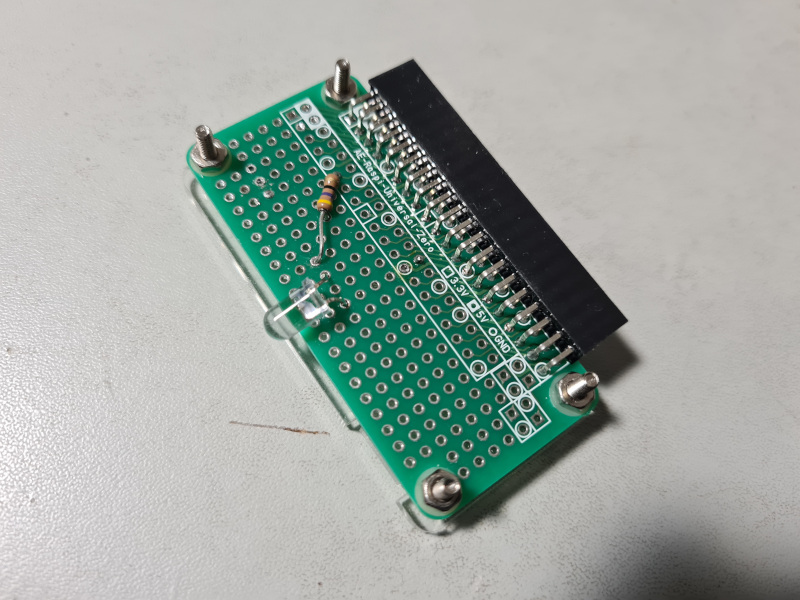

= PC-6601SR用赤外線キーボードエミュレータ (IRKeyboardEmulator)
:numbered:

2021/04/10 by eighttails

== おことわり
本プログラムはまだ開発途中版です。プログラム及びハードウェアの仕様は予告なく変更する可能性があります。

== 概要
NEC社製パソコンPC-6601SRはPC-6001/6601シリーズの中で唯一セパレートタイプとなっており、赤外線による無線キーボードとなっていました。 +
現在においてはそれが仇となり、オークション等ではキーボードなしの本体のみで流通するケースが多く、キーボードの入手が非常に困難になっています。 +
本プログラムは赤外線LEDをRaspberry PIのGPIOでコントロールし、PC-6601SRのキーボードと同等の赤外線信号を送るという代替ソリューションです。

== 動作環境
* Raspberry Pi 本体
** 作者は執筆時点でRaspberry Pi 3Bで動作確認しています。
* Raspberry Pi OS 32ビット版
* 日本語配列キーボード
* 赤外線送信回路(後述)

== 赤外線送信機回路
本プログラムは以下のような回路の赤外線送信回路を想定しております。 +
GPIOは18番を使用してください。

image::doc/IR_emitter.png[]

作者の作例はこのようになっています。 +
(L字型ピンヘッダを用いた関係で、この作例ではピン配置が短辺方向に反転している点に注意してください。)

== ビルド、実行方法
Raspberry PIの実機上でセルフコンパイルを想定しています。 +
このアプリケーションのための専用の環境(SDカード)のご用意を推奨します。

1. 開発環境をインストールします。 +
`sudo apt install git build-essential pigpio`
1. ホームディレクトリにソースコードをダウンロードします。 +
`cd && git clone https://github.com/eighttails/IRKeyboardEmulator.git && cd IRKeyboardEmulator`
1. ビルドを実行。 +
`./build.sh`
1. 実行 +
`./build/IRKeyboardEmulator`

実行イメージはこちらの動画をご覧ください。 +
https://twitter.com/eighttails/status/1346042702765248518

== キー割り当て
PC-6601SR固有のキーは以下のように割り当てられています。 + 
お使いのキーボードによっては機能しないキーがあります。

[options="header"]
|================
|P6キー|割り当てキー
|MODE|PageDown +
F7
|PAGE|PageUp +
F8
|HOME|Home +
F9
|DEL|Backspace +
Delete
|INS|Insert +
F10
|GRPH|左ALT
|かな|右ALT +
F11 +
カタカナ/ひらがな
|STOP|End +
F12
|================

電源キーの割り当てはありません。 +
また現時点でテンキーは使えません。

== 自動起動SDカードイメージ
現時点では開発版で、起動手順が煩雑になっておりますが、将来的にはRaspberry PIにモニタやSSHを接続せずに、電源ONで自動的に本プログラムが起動するディスクイメージを提供したいと考えています。(予定)

== ライセンス
本プログラムはLGPLv2の下でご利用いただけます。 +
キーコードの一覧を http://www.papicom.net[ゆみたろ様] のPC6001Vから拝借しており、そのライセンスを継承してLGPLとしております。

== 参考資料
本プログラムは以下のページを参考に作成されました。 +
記事の執筆者の方々に感謝申し上げます。

* Raspberry Pi 3 で部屋の赤外線受信できる機器をコントロール。
** https://qiita.com/_kazuya/items/62a9a13a4ac140374ce8
* PC-6601SR 赤外線キーボードをWindowsパソコンで代用してみる
** http://p6ers.net/mm/pc-6001/66sr_ir_key
* 66SRのキーボードについて
** http://sbeach.seesaa.net/article/408962018.html
** http://sbeach.seesaa.net/article/408970013.html
