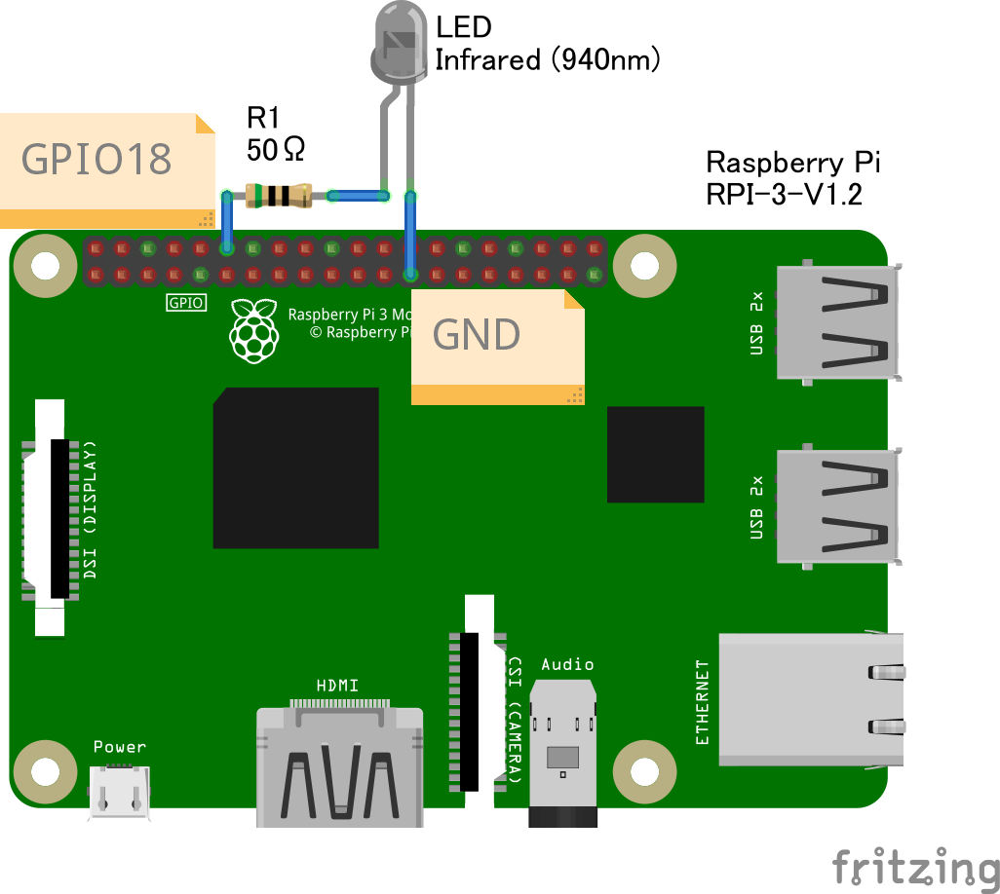

= PC-6601SR用赤外線キーボードエミュレータ (IRKeyboardEmulator)
:toc-title: 目次
:toc: left
:numbered:
:data-uri:
:icons: font

2021/08/07 by eighttails

== 概要
NEC社製パソコンPC-6601SRはPC-6001/6601シリーズの中で唯一セパレートタイプとなっており、赤外線による無線キーボードとなっていました。 +
現在においてはそれが仇となり、オークション等ではキーボードなしの本体のみで流通するケースが多く、キーボードの入手が非常に困難になっています。 +
本プログラムは赤外線LEDをRaspberry PiのGPIOでコントロールし、PC-6601SRのキーボードと同等の赤外線信号を送るという代替ソリューションです。

== 動作環境
* Raspberry Pi 本体
** 作者はでRaspberry Pi 3BおよびRaspberry Pi 400(日本版)で動作確認しています。
* Raspberry Pi OS Lite 32ビット版
* 日本語配列キーボード(Raspberry Pi 400 日本版を推奨)
* 赤外線送信回路(後述)

[WARNING]
英語配列のキーボードは動作対象外です。刻印通りのキーが入力されない、入力できないキーがあるなどの問題が想定されます。

== インストール、実行方法
1. 4GB以上のSDカードをご用意ください。 +
1. 以下のOSイメージファイルをダウンロードして `IRKeyboardEmulator_1.0.0.img` を展開してください。 +
1. Windowsの場合はXXXXを使ってSDカードにイメージを書き込んでください。
1. Linuxの場合はddを使ってSDカードにイメージを書き込んでください。 +
`sudo dd if=IRKeyboardEmulator_1.0.0.img of=(SDカードのデバイス名)`
1. Raspberry PiにSDカードと赤外線送信回路を取り付けて電源を入れてください。自動的にアプリが起動し、赤外線キーボードとして機能するようになります。

[NOTE]
初回起動には数分かかる可能性があります。それ以降は1分以内には起動すると思います。

[NOTE]
起動に当たってモニタは接続する必要はありませんが、モニタを接続した場合、キーのプレス、リリースがコンソールに表示されるようになっています。動作確認としてお使いください。

[NOTE]
赤外線送信機回路が機能しているかどうかの確認には、定番ですがLEDをスマートフォンのカメラで撮影して、キーを押した際に光るかどうかで確認ください。

== 赤外線送信機回路
本プログラムは以下のような回路の赤外線送信回路を想定しております。 +
GPIOは18番を使用してください。

作者の作例はこのようになっています。

== キー割り当て
PC-6601SR固有のキーは以下のように割り当てられています。 + 
お使いのキーボードによっては機能しないキーがあります。

[options="header"]
|================
|P6キー|割り当てキー
|MODE|PageDown +
F7
|PAGE|PageUp +
F8
|HOME|Home +
F9
|DEL|Backspace +
Delete
|INS|Insert +
F10
|GRPH|左ALT
|かな|右ALT +
F11 +
カタカナ/ひらがな
|STOP|End +
F12
|================

電源キーの割り当てはありません。 +
また現時点でテンキーは使えません。

== ビルド方法
Raspberry Piの実機上でセルフコンパイルを想定しています。 +
このアプリケーションのための専用の環境(SDカード)のご用意ください。

[WARNING]
この手順を実行すると、以降このSDカードは当アプリケーション専用の環境となり、シェルや他のアプリが使えなくなります。必ず専用のSDカードをご用意ください。 

1. gitをインストールします。 +
`sudo apt install git`
1. ホームディレクトリにソースコードをダウンロードします。 +
`cd && git clone https://github.com/eighttails/IRKeyboardEmulator.git && cd IRKeyboardEmulator`
1. 環境構築、ビルドを実行。 +
`./setup.sh`
1. 再起動 +
`sudo reboot`

実行イメージはこちらの動画をご覧ください。 +
https://twitter.com/eighttails/status/1346042702765248518

== ライセンス
本プログラムはLGPLv2の下でご利用いただけます。 +
キーコードの一覧を http://www.papicom.net[ゆみたろ様] のPC6001Vから拝借しており、そのライセンスを継承してLGPLとしております。

== 参考資料
本プログラムは以下のページを参考に作成されました。 +
記事の執筆者の方々に感謝申し上げます。

* Raspberry Pi 3 で部屋の赤外線受信できる機器をコントロール。
** https://qiita.com/_kazuya/items/62a9a13a4ac140374ce8
* PC-6601SR 赤外線キーボードをWindowsパソコンで代用してみる
** http://p6ers.net/mm/pc-6001/66sr_ir_key
* 66SRのキーボードについて
** http://sbeach.seesaa.net/article/408962018.html
** http://sbeach.seesaa.net/article/408970013.html
